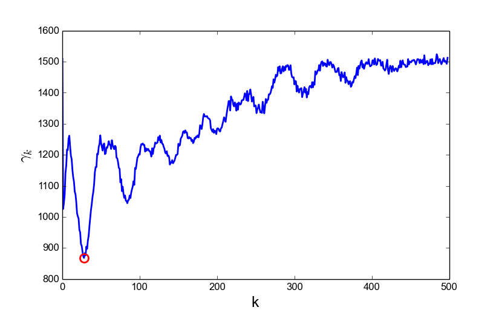

.. PeakDetection documentation master file, created by
   sphinx-quickstart on Tue Apr 21 11:12:07 2015.
   You can adapt this file completely to your liking, but it should at least
   contain the root `toctree` directive.

Automatic Peak Detection of Local Maxima
=========================================

By: `Christopher Smeenk <http://sites.google.com/site/csmeenk>`_

.. toctree::
   :maxdepth: 2

This tutorial illustrates a method for peak detection of quasi-periodic signals. We demonstrate the method using synthetic data, and present applications to astronomical data on sunspot activity, and lab data on EUV spectra from high-harmonic generation.

Reference: F Scholkmann, J Boss and M Wolf. `An Efficient Algorithm for Automatic Peak Detection in Noisy Periodic and Quasi-Periodic Signals <http://dx.doi.org/10.3390/a5040588>`_, Algorithms **5**, 588-603 (2012)

The python code for executing is provided `here <../../source/peak_detect.py>`_.
Dependencies:

* python 2.7 or newer
* python scientific libraries: `matplotlib <http://matplotlib.org/>`_, `scipy <http://scipy.org/>`_

Method
======

Imagine you have a 1-D signal :math:`x_i` sampled at locations :math:`t_i` :math:`(i=1,2,...,N)`. The goal is to find the values :math:`x_i` where the signal is a local maximum. To do this we use a sliding window method. A window of size :math:`2k` slides along the data vector. The value :math:`x_{i-1}` is considered a local maximum if :math:`x_{i-1} > x_{i-k-1}` and :math:`x_{i-1} > x_{i+k-1}`. This process is repeated for all window sizes :math:`k=1,2,...,N/2-1`.

Create the data
"""""""""""""""

We first create and plot a synthetic data set. Here's how it looks:

.. ipython::
	
	In [95]: import pylab as py
	
	In [84]: a = 0.5

	In [85]: b = 0.5

	In [86]: c = 0.5

	In [87]: d = 0.5

	In [88]: fs = 20. #80

	In [89]: f1 = 10.

	In [90]: f2 = 70.

	In [91]: f3 = 5.

	In [92]: t = py.linspace(0,5,1000)  # (0,5,1000)

	In [93]: x = a*py.sin(2.*py.pi*f1/fs*t) + b*py.sin(2.*py.pi*f2/fs*t) + c*py.sin(2.*py.pi*f3/fs*t) + d*(py.rand(t.size)-0.5)

	@savefig signal.png width=4in
	In [94]: py.plot(t,x)

The sliding window test is implemented in a separate function:

.. ipython::

	In [117]: def calcLMS(vec):
	   .....:     L = py.ceil(vec.size/2) - 1
	   .....:     alpha = 1.
	   .....:     M = py.rand(L,vec.size) + alpha
	   .....:     for k in range(1,int(L)):
	   .....:         for i in range(int(k+2), int(vec.size-k+1)):
	   .....:             wk = 2*k
	   .....:             if (vec[i-1] > vec[i-k-1]) and (vec[i-1]>vec[i+k-1]):
	   .....:                 M[k,i] = 0.
	   .....:     return M
	   
After applying the sliding window method we create the local maximum scalogram (LMS), :math:`M_{k,i}`. This shows where the maxima are for each window size. This is what the matrix looks like:

.. ipython::
	
	In [96]: linfit = py.polyfit(t, x, 1)

	In [97]: yfit = py.polyval(linfit, t)

	In [98]: ynew = x - yfit

	In [98]: M = calcLMS(ynew)
	
	In [98]: py.figure();
	
	In [99]: py.imshow(M);
	
	In [99]: py.xlabel('i',fontsize=18)
	
	@savefig LMS.png width=5in
	In [99]: py.ylabel('k',fontsize=18)
	
	

Next, we sum over the rows in the LMS (:math:`t` axis) to determine the ideal size of the window. 

.. math::

	\gamma_k = \sum_i M_{k,i}

The global minimum of :math:`\gamma_k` (red circle) corresponds to the best window size for identifying the local maxima. The LMS is then "rescaled" to remove the data for uninteresting window sizes. The rescaled matrix is called :math:`M^{(r)}`. The final step in peak detection is to calculate the column-wise standard deviation, :math:`\sigma(t)`, of :math:`M^{(r)}`. The zeros in the standard deviation correspond to the locations of the peaks (see the paper for full details).

.. ipython::
	
	In [1]: gamma_k = M.sum(1)
	
	In [1]: lambda_m = gamma_k.argmin() 
	
	In [1]: Mr = M[1:lambda_m, :]
	
	In [1]: sigma = 1./(lambda_m-1) * py.sum( py.sqrt(( Mr - 1./lambda_m* (py.ones((lambda_m-1,1))* Mr.sum(0)) )**2), 0)

In the figure below we show both the data, and the standard deviation function. The value and location of the peaks are shown by the red circles.

.. ipython::
	
	In [1]: py.figure();
	
	In [1]: py.plot(t,x,t,sigma);
	
	In [1]: peakIdx = py.find(sigma == 0) - 1
	
	In [1]: py.plot(t[peakIdx], x[peakIdx], 'or', markerfacecolor='None', markeredgewidth=2, markersize=8)
	
	
.. image:: ../figs/x_and_sigmaVs_t.png

Application: Sunspot Activity
=============================

As a real-life application we consider sunspot activity. Data on sunspot activity can be downloaded from the `Royal Observatory of Belgium <http://sidc.oma.be/DATA/monthssn.dat>`_. We use the algorithm to find the location of the peak sunspot activity and identify the periodicity.

.. plot:: pyplots/sunspots.py
	:include-source:

Application: High-Harmonic Spectra
==================================

As a final application we consider locating the peaks in a high harmonic spectrum. This is could be useful for calibrating an energy scale in the spectrum, or locating absorption peaks.

We measured an EUV spectrum from high-harmonic generation in Ne. The spectrum consists of a comb of peaks spaced by twice the photon energy (:math:`\hbar \omega=1.54` eV for our laser). The spectrum extends up to 72.7 eV (harmonic 47) where it is cutoff by the L\ :sub:`3` edge of an aluminum filter. 

The raw data looks like:

.. image:: ../figs/NeSpectrum2D.png

We next integrate over the rows in the image where the light appears. Then, we find the peaks::

	s = im0[400:560,:].sum(0)
	i = py.arange(s.size)
	peakIdx = peak_detect.getPeaks(i,s)
	py.plot(i,s)
	py.plot(i[peakIdx], s[peakIdx], 'or', markerfacecolor='None', markeredgewidth=2, markersize=8)

.. image:: ../figs/NeSpectrum.png
